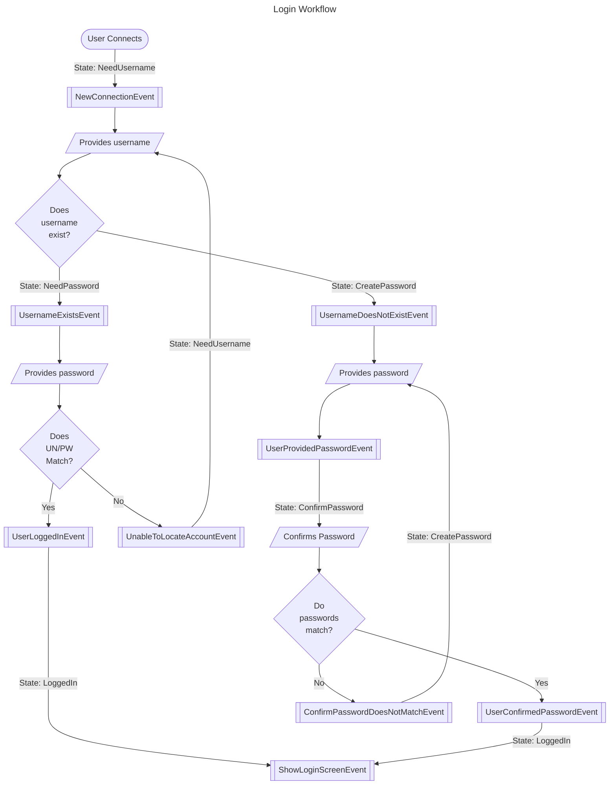

```mermaid
---
title: Login Workflow
---
flowchart

Start([User Connects]) -->|State: NeedUsername| NewConn[[NewConnectionEvent]]
NewConn --> ProvideUsername[/Provides username/]
ProvideUsername --> DoesUnExist{Does\nusername\nexist?}
DoesUnExist -->|State: NeedPassword| UsernameExists[[UsernameExistsEvent]]
DoesUnExist -->|State: CreatePassword| UsernameNoExists[[UsernameDoesNotExistEvent]]

UsernameExists --> ProvidesPassword1[/Provides password/]
ProvidesPassword1 --> CheckAccount{Does\nUN/PW\nMatch?}
CheckAccount -->|Yes| UserLoggedInEvent[[UserLoggedInEvent]]
CheckAccount -->|No| UnableToLocateAccountEvent[[UnableToLocateAccountEvent]]
UnableToLocateAccountEvent -->|State: NeedUsername| ProvideUsername
UserLoggedInEvent -->|State: LoggedIn| ShowLoginScreenEvent[[ShowLoginScreenEvent]]

UsernameNoExists --> ProvidesPassword2[/Provides password/]
ProvidesPassword2 --> UserProvidedPasswordEvent[[UserProvidedPasswordEvent]]
UserProvidedPasswordEvent -->|State: ConfirmPassword| ConfirmsPassword[/Confirms Password/]
ConfirmsPassword --> DoTheyMatch{Do\npasswords\nmatch?}
DoTheyMatch -->|Yes| UserConfirmedPasswordEvent[[UserConfirmedPasswordEvent]]
DoTheyMatch -->|No| ConfirmPasswordDoesNotMatchEvent[[ConfirmPasswordDoesNotMatchEvent]]
UserConfirmedPasswordEvent -->|State: LoggedIn| ShowLoginScreenEvent
ConfirmPasswordDoesNotMatchEvent -->|State: CreatePassword| ProvidesPassword2
```
