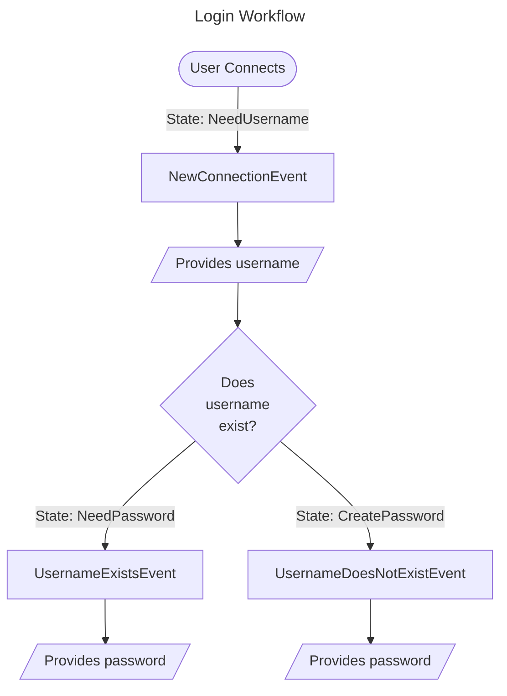

```mermaid
---
title: Login Workflow
---
flowchart

Start([User Connects]) -->|State: NeedUsername| NewConn[NewConnectionEvent]
NewConn --> ProvideUsername[/Provides username/]
ProvideUsername --> DoesUnExist{Does\nusername\nexist?}
DoesUnExist -->|State: NeedPassword| UsernameExists[UsernameExistsEvent]
DoesUnExist -->|State: CreatePassword| UsernameNoExists[UsernameDoesNotExistEvent]

UsernameExists --> ProvidesPassword[/Provides password/]

UsernameNoExists --> NewPassword[/Provides password/]
```
