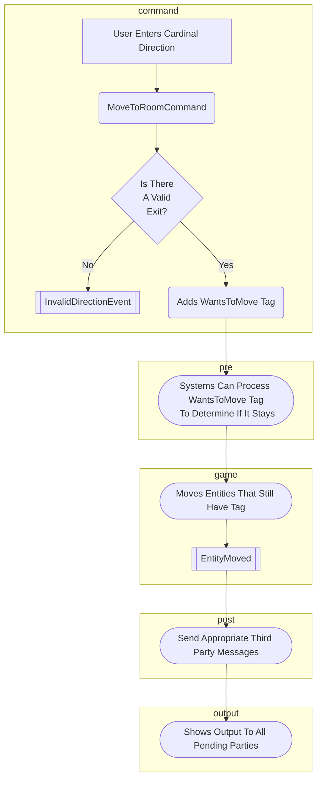

# Moving A Character

```mermaid
flowchart

subgraph command
    direction TB
    %%Supposes Character Is Already At A Location%%
    Start1[User Enters Cardinal Direction] --> MoveToRoomCommand(MoveToRoomCommand)
    MoveToRoomCommand --> IsThereAValidExit{Is There\nA Valid\nExit?}
    IsThereAValidExit -- No --> InvalidDirectionEvent[[InvalidDirectionEvent]]
    IsThereAValidExit -- Yes --> AddWantsToMoveTag(Adds WantsToMove Tag)
end

subgraph pre
    AddWantsToMoveTag --> Systems1([Systems Can Process WantsToMove Tag\n To Determine If It Stays])
end

subgraph game
    Systems1 --> Systems2
    Systems2([Moves Entities That Still Have Tag]) --> EntityMoved[[EntityMoved]]
end

subgraph post
    EntityMoved[[EntityMoved]] --> Systems3
    Systems3([Send Appropriate Third Party Messages])
end

subgraph output
    Systems3 --> Output1
    Output1([Shows Output To All Pending Parties])
end
```
