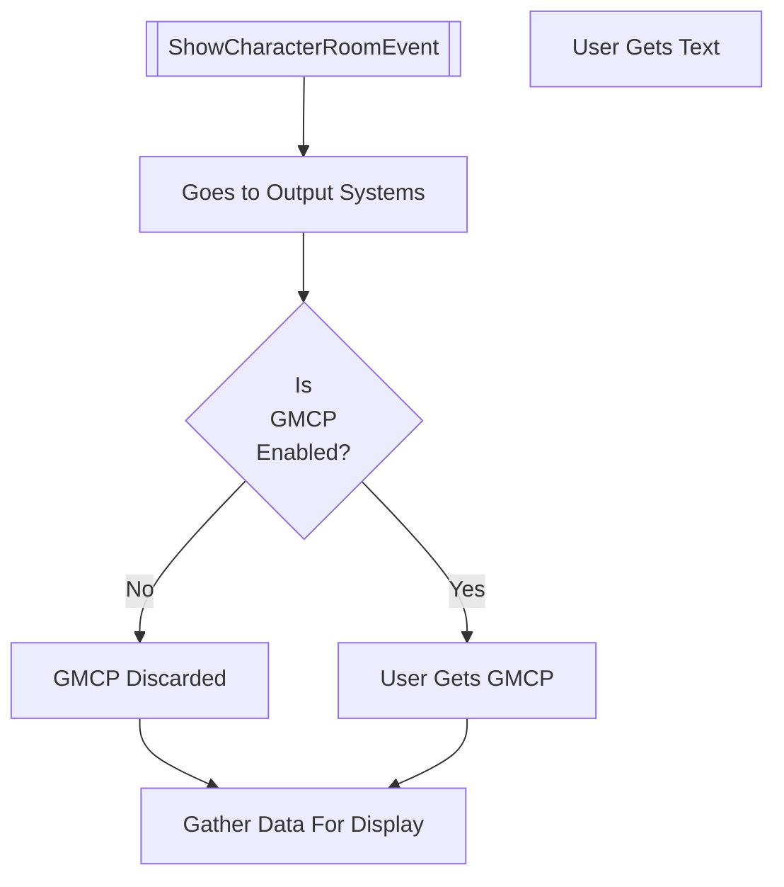

# Networking

```mermaid
flowchart

ShowCharacterRoom[[ShowCharacterRoomEvent]] --> GoesToOutput[Goes to Output Systems]
GoesToOutput --> IsGmcp
IsGmcp{Is\nGMCP\nEnabled?}

IsGmcp -- Yes --> UserGetsGmcp
IsGmcp -- No --> GmcpDiscarded

UserGetsGmcp[User Gets GMCP]
GmcpDiscarded[GMCP Discarded]

GmcpDiscarded --> GatherData
UserGetsGmcp --> GatherData

GatherData[Gather Data For Display]

UserGetsText[User Gets Text]
```